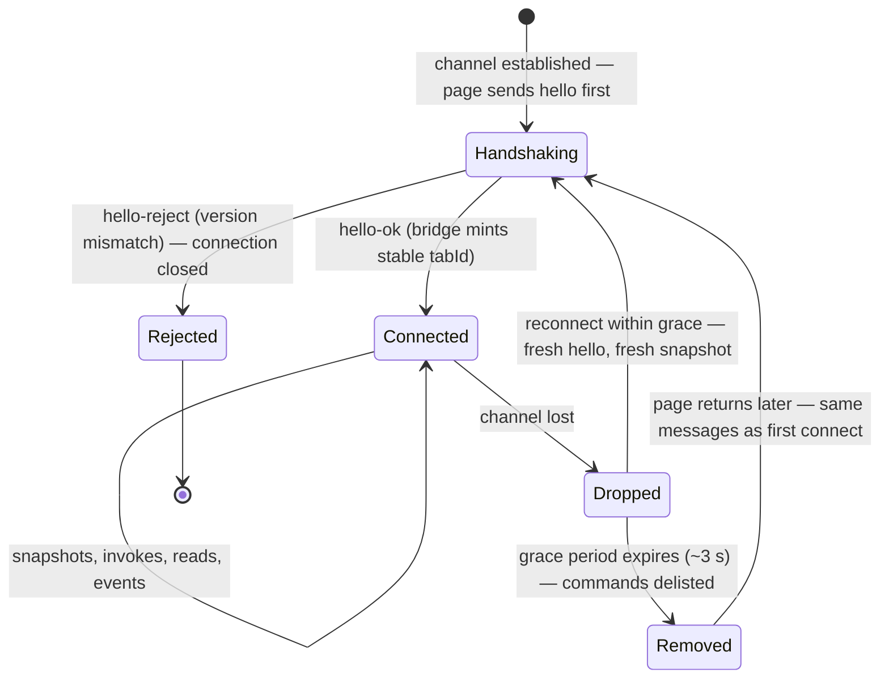
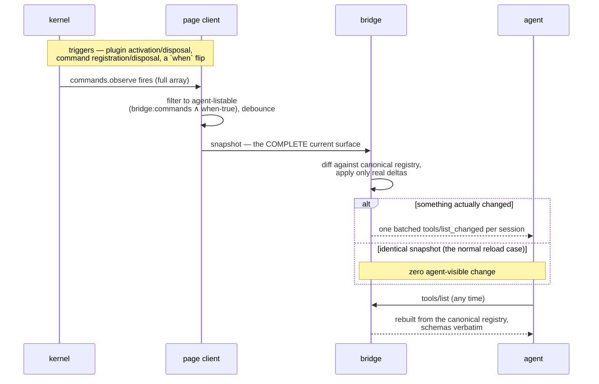
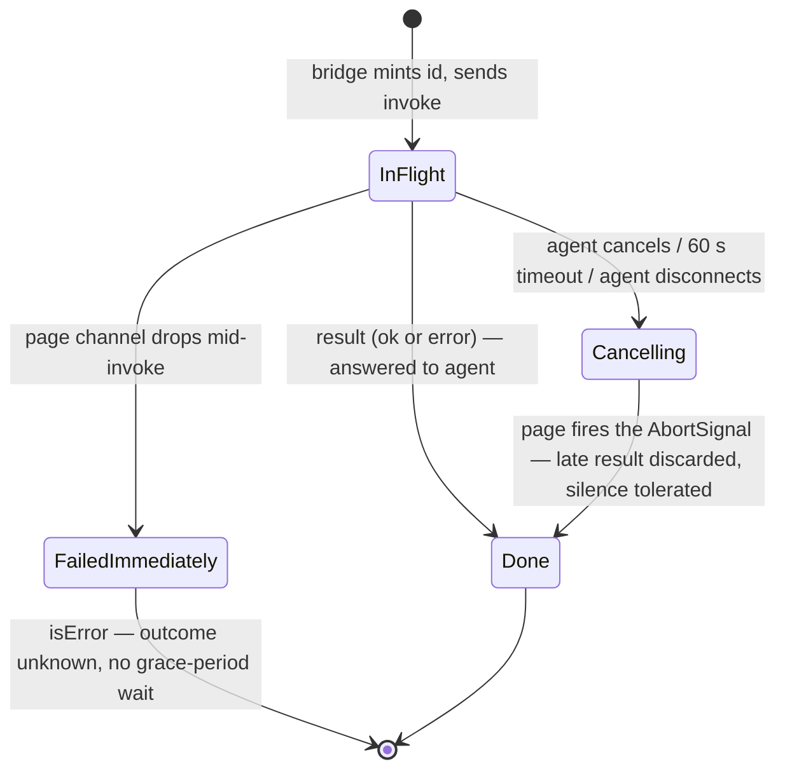
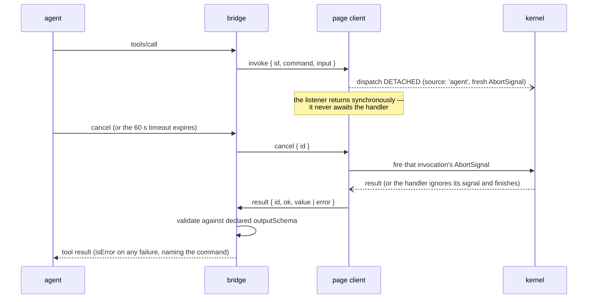
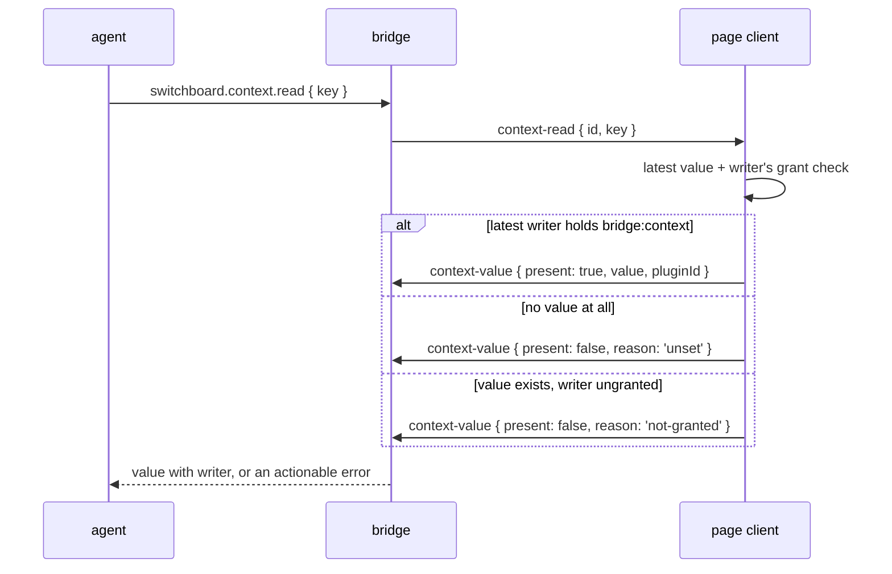
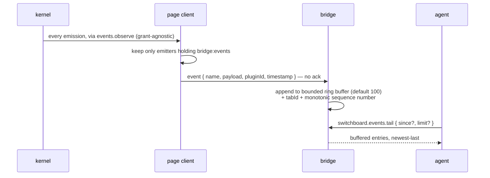

# Bridge flows

This file covers what happens on the page path over time: connection and reconnection, snapshot sync, invocation and cancellation, context reads, and events polling. Static layout is covered in [`topology.md`](./topology.md), and exposure rules in [`exposure-model.md`](./exposure-model.md). Source of truth: [bridge §4–§9](../spec/bridge-protocol.md#4-the-message-envelope), [§13–§14](../spec/bridge-protocol.md#13-active-tab-and-multi-tab).

Four participants appear in the diagrams below: the **agent** (any MCP client), the **bridge** (`bridge-mcp`'s node side, meaning the MCP edge plus the bridge core), the **page client** (`bridge-mcp`'s browser export, attached by the adapter's bootstrap), and the **kernel** (`core`, running in the page).

## Connection

A tab's connection over its lifetime ([bridge §5](../spec/bridge-protocol.md#5-handshake), [§14](../spec/bridge-protocol.md#14-page-absence-and-reconnection)):

- `hello` is the first message on every connection, including reconnections. There is no resume or resync protocol. `hello-ok` mints a tab id that stays stable for the lifetime of that connection.
- `hello-reject` carries both protocol versions, both kernel API versions, and a plain-language reason. The page shows "reload this tab," and the bridge reports the status through `switchboard.status` ([bridge §5.3](../spec/bridge-protocol.md#53-rejection), [§11.1](../spec/bridge-protocol.md#111-switchboardstatus)).
- The grace period is sized so that ordinary page reloads reconnect inside it, with about 3 seconds recommended ([bridge §14.2](../spec/bridge-protocol.md#142-the-grace-period)). A reconnecting page re-announces the same snapshot, so a common reload usually produces no agent-visible change. Only a genuinely absent page shrinks the tool list.
- Reconnection uses the same handshake and snapshot messages as a first connect, so correctness needs no resume state ([bridge §14.3](../spec/bridge-protocol.md#143-reconnection)). Channel retry and backoff stay an adapter concern ([adapter contract §3.4](../spec/adapter-contract.md#34-reconnection)).
- When several tabs are connected, the canonical agent-facing registry mirrors the active tab, meaning the most recently focused one — tabs send `focus`. If the active tab drops, the bridge fails over to another connected tab, subject to the grace period. Agents receive the switch as an ordinary registry diff ([bridge §13.2](../spec/bridge-protocol.md#132-the-active-tab-model)).
- With no connected page the MCP endpoint stays available. The three built-in tools keep working, and invoking a page command returns an actionable `isError` ([bridge §14.1](../spec/bridge-protocol.md#141-the-endpoint-stays-up)).

## Snapshot sync

Registry sync uses full snapshots and no delta protocol, which avoids drift between page and bridge state ([bridge §6](../spec/bridge-protocol.md#6-registry-sync-snapshots)):

The page computes both filters itself, because it holds the manifests ([bridge §6.2](../spec/bridge-protocol.md#62-what-the-page-announces)). A burst of changes produces one debounced message. Change notifications are lossy cache-invalidation hints: a client that ignores them and re-lists still sees the canonical state ([bridge §10.1](../spec/bridge-protocol.md#101-transport-and-sessions)).

## Invocation

The full lifecycle of one agent call ([bridge §7](../spec/bridge-protocol.md#7-invocation-lifecycle)):

- Dispatch runs detached, and the message listener returns without waiting for the handler ([bridge §7.2](../spec/bridge-protocol.md#72-the-message-loop-rule)). If the listener awaits a running handler, message processing stalls, and that includes delivery of `cancel`. Transport testing showed this directly: inline awaiting delayed cancellation until the command had already finished.
- Three causes converge on one path. Agent-side cancellation, bridge timeout (60 seconds by default), and agent disconnect mid-call all arrive as the same `cancel` message. Cancellation is cooperative and best-effort: if a handler ignores its signal and finishes, the bridge tolerates either a late `result`, which it discards, or silence ([bridge §7.3](../spec/bridge-protocol.md#73-cancellation), [§7.4](../spec/bridge-protocol.md#74-bridge-timeout)).
- Disconnect mid-invoke fails immediately, with *page disconnected during invocation; outcome unknown*. The bridge does not wait out the grace period, because the outcome is already unknown ([bridge §7.5](../spec/bridge-protocol.md#75-disconnect-mid-invoke)).

## Context reads

A context read is a live round-trip to the page. The bridge keeps no mirror and no cache anywhere, so there is no staleness story ([bridge §8](../spec/bridge-protocol.md#8-context-reads)):

The two `present: false` reasons exist so the built-in tool can report something actionable rather than a bare miss ([bridge §8.2](../spec/bridge-protocol.md#82-grant-semantics), [§11.2](../spec/bridge-protocol.md#112-switchboardcontextread)).

## Events and the tail buffer

Events are pushed from page to bridge and then recorded. Agents retrieve them by polling `switchboard.events.tail` rather than receiving server push ([bridge §9](../spec/bridge-protocol.md#9-events-and-the-tail-buffer)):

The page client sees emissions through the kernel's whole-bus tap, which is grant-agnostic, so the `bridge:events` filter is applied page-side before anything is pushed ([kernel §7.1](../spec/kernel-api.md#71-the-whole-bus-tap-eventsobserve), [bridge §9.1](../spec/bridge-protocol.md#91-event-push)). The bridge holds the tail buffer as a subscriber. Kernel Events stay ephemeral and are not buffered in the kernel ([kernel §7](../spec/kernel-api.md#7-events)). Sequence numbers support incremental polling. The buffer survives page reloads and disconnections, but it lasts only as long as the process and is cleared when the dev server stops ([bridge §9.2](../spec/bridge-protocol.md#92-the-tail-buffer), [§14.4](../spec/bridge-protocol.md#144-what-dies-with-the-server)).
