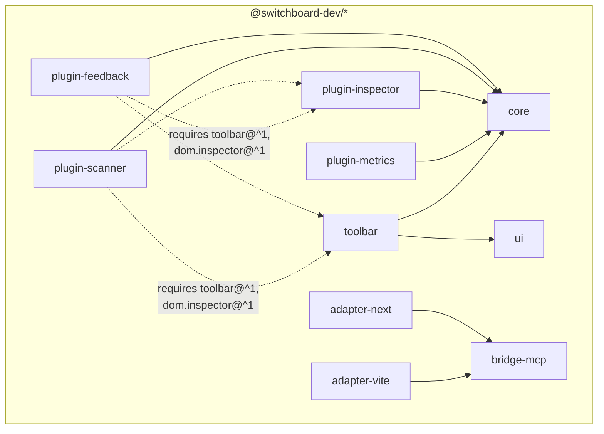

# Components & versioning

This file covers package responsibilities and versioning: what each of the ten `@switchboard-dev/*` packages and two example apps is responsible for, which boundaries exist, which spec defines each one, and the four independent version numbers. Runtime message flow is covered in [`bridge-flows.md`](./bridge-flows.md), and execution environments in [`topology.md`](./topology.md). Source of truth: [spec index](../spec/README.md#versions).

## The packages

| Package | Responsibility | Deliberately does not |
|---|---|---|
| `core` | The kernel: plugin definition and activation, the four primitives (Command, Event, Context, Service), capabilities, `when`, permissions, storage, diagnostics, `createSwitchboard`, and the handoff ([kernel spec](../spec/kernel-api.md)) | Import UI frameworks. Carry any placement or DOM terms. Detect the environment ([kernel §1](../spec/kernel-api.md#1-scope), [§18.4](../spec/kernel-api.md#184-topology-client-only-one-kernel-per-tab)). Depend on a schema library ([kernel §6.2](../spec/kernel-api.md#62-schemas)) |
| `ui` | Headless plain-DOM factories for the panel-chrome accessibility patterns P1–P8 ([toolbar §8](../spec/toolbar-contract.md#8-accessibility-the-pattern-set-p1p8)). Zero runtime dependencies | Ship visual chrome, or couple to the kernel. It is mechanism only, and an adapter may meet §7–§8 without using it ([toolbar §7](../spec/toolbar-contract.md#7-panel-chrome-adapter-obligations)) |
| `toolbar` | The first-party toolbar adapter. Provides `toolbar@1.0.0`, registers the `toolbar` Service, maintains the item, badge, and panel registries, cluster ordering, and visual chrome, built on `ui` | Hold special status. It is one adapter among possible many, and the contract cannot tell it apart from another ([toolbar §2.1](../spec/toolbar-contract.md#21-provision)) |
| `bridge-mcp` | Both sides of the page path. The node side holds the bridge core, canonical registry, tail buffer, MCP edge, `startBridgeServer`, and the shared WebSocket implementation. The browser-only subpath export holds the page client, so the protocol and its version are defined once ([adapter contract §1.1](../spec/adapter-contract.md#11-the-split), [§4.3](../spec/adapter-contract.md#43-the-shared-websocket-implementation)) | Let the kernel grow a schema-validator dependency. Ajv lives here, at the `outputSchema` enforcement point ([bridge §10.4](../spec/bridge-protocol.md#104-outputschema-enforcement)) |
| `adapter-vite` | A Vite plugin (`apply: 'serve'`): mounts the bridge from `configureServer`, rides Vite's HMR WebSocket as the page channel, and injects the bootstrap ([adapter contract §10](../spec/adapter-contract.md#10-switchboard-devadapter-vite-binding)) | Reimplement any of the page client ([adapter contract §1.1](../spec/adapter-contract.md#11-the-split)) |
| `adapter-next` | A server entry (`register`, for `instrumentation.ts`) and a client entry (bootstrap plus the `<SwitchboardDev load>` loader). Both connect through the bridge port ([adapter contract §11](../spec/adapter-contract.md#11-switchboard-devadapter-next-binding)) | Same |
| `plugin-metrics` | Headless Web Vitals telemetry, the pure producer: no commands, no UI, read through built-ins only ([brief](../spec/plugins/metrics.md)) | |
| `plugin-inspector` | The v1 provider of `dom.inspector@1.0.0`: the element registry, `dom.describe-element`, and `dom.pick-element` ([brief](../spec/plugins/inspector.md), [contract](../spec/dom-inspector-contract.md)) | |
| `plugin-scanner` | On-demand axe-core scans, the UI-heavy consumer, and the only plugin carrying a real third-party dependency ([brief](../spec/plugins/scanner.md)) | |
| `plugin-feedback` | Annotations and the human → agent → human loop, walked through in [`feedback-loop.md`](./feedback-loop.md) ([brief](../spec/plugins/feedback.md)) | |
| `example-vite`, `example-next` | One runnable app per adapter, set up with the four reference plugins. Private, never published | |

## Who depends on whom

Package dependencies (solid) versus capability requirements resolved at activation (dashed). These are different mechanisms, and the dashed ones involve no npm edge at all ([kernel §10](../spec/kernel-api.md#10-capabilities)):

The key constraints: `core` depends on nothing UI-shaped; `ui` depends on nothing at all; adapters depend on `bridge-mcp` rather than `core`, and reach the kernel only through the page-global handoff ([kernel §17](../spec/kernel-api.md#17-the-kernel-handoff)). A `requires` edge points at a capability name, not a package, so any conforming provider of `toolbar@^1` satisfies the scanner — not only `@switchboard-dev/toolbar` ([toolbar §2.1](../spec/toolbar-contract.md#21-provision)).

The kernel has no placement API at all: no `api.toolbar.*`, and no manifest field for toolbar contributions ([toolbar §1](../spec/toolbar-contract.md#1-scope)). The toolbar's entire contribution surface is one Service behind a capability, so an app that installs no toolbar ignores all of it structurally.

## The boundaries and their source specs

Each boundary between parties has one source spec:

| Boundary | Mechanism | Source spec |
|---|---|---|
| plugin ↔ kernel | `definePlugin` + `PluginApi` | [kernel §3](../spec/kernel-api.md#3-plugin-definition)–[§5](../spec/kernel-api.md#5-pluginapi) |
| plugin ↔ plugin, **data** | Events and Context, as plain JSON | [kernel §7](../spec/kernel-api.md#7-events)–[§8](../spec/kernel-api.md#8-context), [§14](../spec/kernel-api.md#14-the-plain-json-rule) |
| plugin ↔ plugin, **live objects** | Services, gated by capabilities | [kernel §9](../spec/kernel-api.md#9-services)–[§10](../spec/kernel-api.md#10-capabilities) |
| plugin ↔ UI placement | the `toolbar` Service: items, badges, panels, mount | [toolbar contract](../spec/toolbar-contract.md) |
| plugin ↔ DOM identity | ElementReference, hydration, element descriptions | [dom.inspector contract](../spec/dom-inspector-contract.md) |
| page ↔ bridge | the Switchboard protocol | [bridge §4](../spec/bridge-protocol.md#4-the-message-envelope)–[§9](../spec/bridge-protocol.md#9-events-and-the-tail-buffer) |
| bridge ↔ agent | the MCP edge and built-in tools | [bridge §10](../spec/bridge-protocol.md#10-the-agent-edge)–[§11](../spec/bridge-protocol.md#11-built-in-tools) |
| adapter ↔ everything | mounting, channels, security, port, bootstrap, config | [adapter contract](../spec/adapter-contract.md) |
| everyone ↔ failure | loud errors, dev-mode warnings, the code table | [diagnostics](../spec/diagnostics.md) |
| host app ↔ kernel | `createSwitchboard`, the instance, the handoff | [kernel §16](../spec/kernel-api.md#16-registry-observation-and-the-plugin-list)–[§18](../spec/kernel-api.md#18-constructing-the-kernel-createswitchboard) |

## The four version numbers

Four independent numbers, each covering a different compatibility gate and each failing its own way ([spec index, "Versions"](../spec/README.md#versions)):

| Version | Shape | Gates | How it fails |
|---|---|---|---|
| Kernel API **v1** | semver on the `core` package | Nothing at runtime. It versions the API surface, the manifest schema, and the permission strings ([kernel §15](../spec/kernel-api.md#15-versioning-and-forward-compatibility)) | Ordinary npm semver discipline; no runtime check |
| **`BRIDGE_PROTOCOL_VERSION: 1`** | plain integer | The handshake — the only compatibility gate on the page path. Exact match or refusal, with no range negotiation ([bridge §2](../spec/bridge-protocol.md#2-versioning-the-handshake-gate)) | `hello-reject` carrying both protocol versions, both kernel API versions, and a plain-language reason. The remedy is always "reload this tab" ([bridge §5.3](../spec/bridge-protocol.md#53-rejection)) |
| **`toolbar@1.0.0`** | capability semver, versioning the *contract* rather than any npm package ([toolbar §2.2](../spec/toolbar-contract.md#22-versioning)) | Plugin activation: the kernel's `satisfies` check on `requires` ranges ([kernel §10.3](../spec/kernel-api.md#103-the-check)) | A loud `capability-unsatisfied` naming the requirer, the requirement, and every near-miss. Blocks that plugin only |
| **`dom.inspector@1.0.0`** | capability semver, same rules ([dom.inspector §8](../spec/dom-inspector-contract.md#8-versioning)) | Same activation check | Same |

The kernel API version also travels in the handshake, but for diagnostics only — it is not a compatibility gate ([bridge §2](../spec/bridge-protocol.md#2-versioning-the-handshake-gate)). The plugin manifest's `version` field is informational, used for inspector display and bug reports. There is deliberately no `manifestVersion`, because the manifest schema versions with the kernel API ([kernel §3.1](../spec/kernel-api.md#31-defineplugin-and-the-manifest)).

## One rule for forward compatibility

The same rule applies at every boundary above ([kernel §15](../spec/kernel-api.md#15-versioning-and-forward-compatibility)):

- **Unknown fields are tolerated.** Unknown manifest fields, permission strings, activation hints, message types and fields, and toolbar contribution fields are all carried through with a dev-mode warning, and never imply a grant.
- **Malformed input is rejected loudly**, blocking only the affected plugin, contribution, or message.

That is what lets every surface grow additively: new optional fields and new codes ride the tolerance, and only breaking changes touch a version number.
