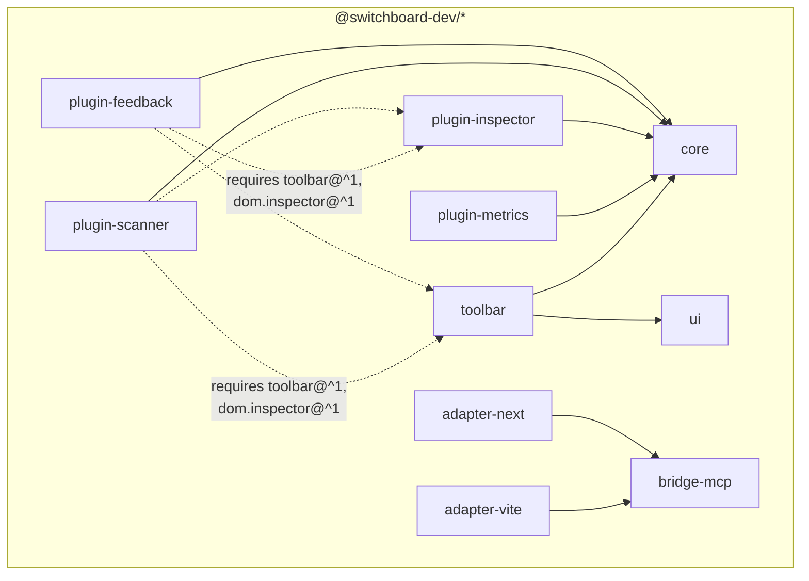

# Components & versioning

**This file owns the package ownership map and the version story**: what each of the ten `@switchboard-dev/*` packages (plus the two example apps) owns, which boundaries exist and which document owns each, and the four independent version numbers. Runtime message flow is [`bridge-flows.md`](./bridge-flows.md)'s subject; the worlds and process boundaries are [`topology.md`](./topology.md)'s.

## The packages

| Package | Owns | Deliberately does not |
|---|---|---|
| `core` | the kernel: plugin definition and activation, the four primitives (Command, Event, Context, Service), capabilities, `when`, permissions, storage, diagnostics, `createSwitchboard` and the handoff ([kernel spec](../spec/kernel-api.md)) | import UI frameworks; carry any placement or DOM vocabulary; sniff the environment ([kernel §1](../spec/kernel-api.md#1-scope), [§18.4](../spec/kernel-api.md#184-topology-client-only-one-kernel-per-tab)); depend on a schema library ([kernel §6.2](../spec/kernel-api.md#62-schemas)) |
| `ui` | headless plain-DOM factories for the panel-chrome accessibility patterns P1–P8 ([toolbar §8](../spec/toolbar-contract.md#8-accessibility-the-pattern-set-p1p8)); zero runtime dependencies | any visual chrome, any kernel coupling — it is mechanism only, and conformance to §7–§8 without it is fully legal ([toolbar §7](../spec/toolbar-contract.md#7-panel-chrome-adapter-obligations), non-normative note) |
| `toolbar` | the first-party toolbar adapter: provides `toolbar@1.0.0`, registers the `toolbar` Service, owns item/badge/panel registries, cluster ordering, and all visual chrome, composed on `ui` | hold special status — it is one adapter among possible many, indistinguishable by contract ([toolbar §2.1](../spec/toolbar-contract.md#21-provision)) |
| `bridge-mcp` | both halves of the wire: the node side (bridge core, canonical registry, tail buffer, MCP edge, `startBridgeServer`, the shared WS door) and the browser-only subpath export holding the **wire client** — so the protocol and its version are defined once ([adapter contract §1.1](../spec/adapter-contract.md#11-the-split), [§4.3](../spec/adapter-contract.md#43-the-shared-ws-door)) | let the kernel grow a schema-validator dependency — Ajv lives here, at the `outputSchema` enforcement point ([bridge §10.4](../spec/bridge-protocol.md#104-outputschema-enforcement)) |
| `adapter-vite` | a Vite plugin (`apply: 'serve'`): mounts the bridge from `configureServer`, rides Vite's HMR WebSocket as the page channel, injects the bootstrap ([adapter contract §10](../spec/adapter-contract.md#10-switchboard-devadapter-vite-normative-binding)) | reimplement any of the wire client ([adapter contract §1.1](../spec/adapter-contract.md#11-the-split)) |
| `adapter-next` | server entry (`register` for `instrumentation.ts`) and client entry (bootstrap + the `<SwitchboardDev load>` loader); both doors on the bridge port ([adapter contract §11](../spec/adapter-contract.md#11-switchboard-devadapter-next-normative-binding)) | same |
| `plugin-metrics` | headless Web Vitals telemetry — the pure producer: no commands, no UI, read through built-ins only ([brief](../spec/plugins/metrics.md)) | |
| `plugin-inspector` | the v1 provider of `dom.inspector@1.0.0`: the element registry, `dom.describe-element`, `dom.pick-element` ([brief](../spec/plugins/inspector.md), [contract](../spec/dom-inspector-contract.md)) | |
| `plugin-scanner` | on-demand axe-core scans — the UI-heavy consumer, and the suite's real third-party-dependency carrier ([brief](../spec/plugins/scanner.md)) | |
| `plugin-feedback` | annotations and the human → agent → human loop — the flagship ([brief](../spec/plugins/feedback.md), walked through in [`feedback-loop.md`](./feedback-loop.md)) | |
| `example-vite`, `example-next` | one runnable app per adapter, wired with the four reference plugins; private, never published | |

## Who depends on whom

Package-level dependencies (solid) versus capability-level requirements resolved at activation (dashed) — the two are different mechanisms, and the dashed ones involve no npm edge at all ([kernel §10](../spec/kernel-api.md#10-capabilities)):

Load-bearing negatives: `core` depends on nothing UI-shaped; `ui` depends on nothing at all (zero runtime dependencies, framework-free); adapters depend on `bridge-mcp`, not on `core` — they meet the kernel only through the page-global handoff ([kernel §17](../spec/kernel-api.md#17-the-kernel-handoff)). A capability `requires` edge points at a **capability name**, not a package: any conforming provider of `toolbar@^1` satisfies the scanner, not just `@switchboard-dev/toolbar` ([toolbar §2.1](../spec/toolbar-contract.md#21-provision)).

The kernel carries **no placement vocabulary** — no `api.toolbar.*`, no manifest field for toolbar contributions ([toolbar §1](../spec/toolbar-contract.md#1-scope)). The toolbar's entire contribution surface is one Service behind a capability, so an app that installs no toolbar ignores the whole vocabulary structurally.

## The boundaries and their owners

Every seam between parties has exactly one owning document:

| Boundary | Mechanism | Owned by |
|---|---|---|
| plugin ↔ kernel | `definePlugin` + `PluginApi` | [kernel §3](../spec/kernel-api.md#3-plugin-definition)–[§5](../spec/kernel-api.md#5-pluginapi) |
| plugin ↔ plugin, **data** | Events and Context, wire-legal JSON | [kernel §7](../spec/kernel-api.md#7-events)–[§8](../spec/kernel-api.md#8-context), [§14](../spec/kernel-api.md#14-the-wire-legal-rule) |
| plugin ↔ plugin, **live objects** | Services, gated by capabilities | [kernel §9](../spec/kernel-api.md#9-services)–[§10](../spec/kernel-api.md#10-capabilities) |
| plugin ↔ UI placement | the `toolbar` Service: items, badges, panels, mount | [toolbar contract](../spec/toolbar-contract.md) |
| plugin ↔ DOM identity | ElementReference, hydration, element descriptions | [dom.inspector contract](../spec/dom-inspector-contract.md) |
| page ↔ bridge | the Switchboard wire protocol | [bridge §4](../spec/bridge-protocol.md#4-the-wire-envelope)–[§9](../spec/bridge-protocol.md#9-events-and-the-tail-buffer) |
| bridge ↔ agent | the MCP edge and built-in tools | [bridge §10](../spec/bridge-protocol.md#10-the-agent-edge)–[§11](../spec/bridge-protocol.md#11-built-in-tools) |
| adapter ↔ everything | mounting, channels, security, port, bootstrap, config | [adapter contract](../spec/adapter-contract.md) |
| everyone ↔ failure | loud errors, dev-mode warnings, the code table | [diagnostics](../spec/diagnostics.md) |
| host app ↔ kernel | `createSwitchboard`, the instance, the handoff | [kernel §16](../spec/kernel-api.md#16-registry-observation-and-the-plugin-list)–[§18](../spec/kernel-api.md#18-constructing-the-kernel-createswitchboard) |

## The four version numbers

Four independent numbers, each gating a different door, each failing differently ([spec index, "Versions"](../spec/README.md#versions)):

| Version | Shape | Gates | How it fails |
|---|---|---|---|
| Kernel API **v1** | semver on the `core` package | nothing at runtime — it versions the API surface, manifest schema, and permission vocabulary ([kernel §15](../spec/kernel-api.md#15-versioning-and-forward-compatibility)) | ordinary npm semver discipline; no runtime check |
| **`BRIDGE_PROTOCOL_VERSION: 1`** | plain integer | the wire handshake — the **sole** compatibility gate, exact match or refusal, no range negotiation ([bridge §2](../spec/bridge-protocol.md#2-versioning-the-handshake-gate)) | `hello-reject` carrying both protocol versions, both kernel API versions, and a plain-language reason; remedy is always "reload this tab" ([bridge §5.3](../spec/bridge-protocol.md#53-rejection)) |
| **`toolbar@1.0.0`** | capability semver — versions the *contract*, decoupled from any npm package version ([toolbar §2.2](../spec/toolbar-contract.md#22-versioning)) | plugin activation: the kernel's `satisfies` check on `requires` ranges ([kernel §10.3](../spec/kernel-api.md#103-the-check)) | loud `capability-unsatisfied` naming the requirer, the requirement, and every near-miss; blocks that plugin only |
| **`dom.inspector@1.0.0`** | capability semver, same posture ([dom.inspector §8](../spec/dom-inspector-contract.md#8-versioning)) | same activation check | same |

The kernel API version also travels in the wire handshake, **for diagnostics only** — it must never gate ([bridge §2](../spec/bridge-protocol.md#2-versioning-the-handshake-gate)). The plugin manifest's `version` field is a fifth number only in appearance: it is **informational only** (inspector display, bug reports), and there is deliberately no `manifestVersion` — the manifest schema versions with the kernel API ([kernel §3.1](../spec/kernel-api.md#31-defineplugin-and-the-manifest)).

## The uniform forward-compatibility posture

One posture everywhere, at every boundary above ([kernel §15](../spec/kernel-api.md#15-versioning-and-forward-compatibility)):

- **Unknown = tolerated**: unknown manifest fields, permission strings, activation hints, wire message types and fields, toolbar contribution fields — dev-mode warning, preserved/carried verbatim, never an error, **never a grant**.
- **Malformed = rejected loudly**, blocking that plugin (or contribution, or message) only.

This is what lets every surface evolve additively: new optional fields and new codes ride the tolerance; only breaking changes touch a version number.
