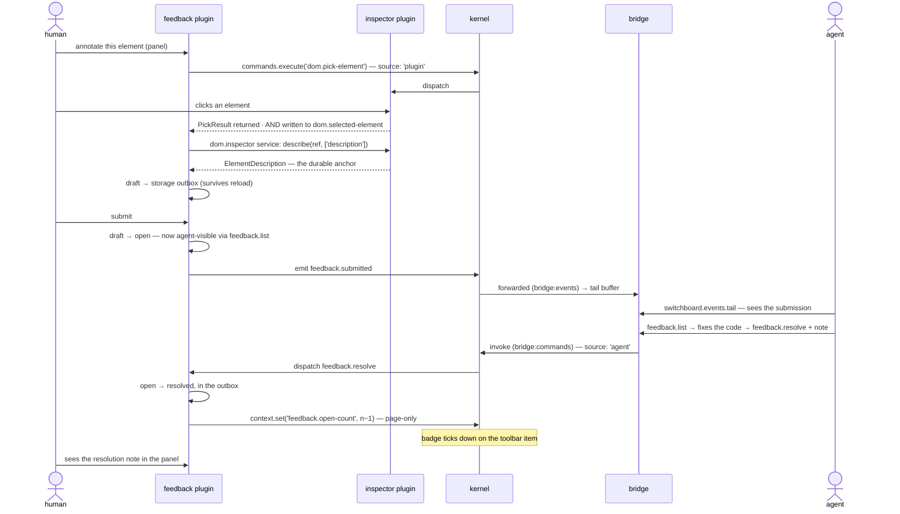

# The agent feedback loop

**This file owns the flagship walkthrough**: the end-to-end human → agent → human loop the feedback plugin exists to prove, and the best single demonstration that the four primitives compose under load ([feedback brief §8](../spec/plugins/feedback.md#8-flagship-success-criterion-the-agent-loop)). It **reuses** the models drawn elsewhere: why each piece is visible or invisible is [`exposure-model.md`](./exposure-model.md); how each message crosses the wire is [`bridge-flows.md`](./bridge-flows.md). Neither is redrawn here.

## The loop

Step by step, with what each step demonstrates:

1. **A human picks an element.** The feedback plugin invokes `dom.pick-element` **cross-plugin** through `api.commands.execute`, arriving at the inspector with `invocation.source: 'plugin'` — in-page dispatch is a first-class path, not a bridge-only affair ([feedback brief §5](../spec/plugins/feedback.md#5-anchoring-rides-the-loose-route), [kernel §6.1](../spec/kernel-api.md#61-registration-and-dispatch)).
2. **The result arrives twice, normatively.** A completed pick both *returns* the result to its invoker and *writes* the envelope to the `dom.selected-element` context key — the dual outcome blesses both consumption styles ([dom.inspector §6.1](../spec/dom-inspector-contract.md#61-the-dual-outcome)).
3. **Hydration goes through the Service, not the bridge.** The plugin fetches the `description` facet via the `dom.inspector` **service** — an in-page consumer hydrates without a round-trip ([dom.inspector §4](../spec/dom-inspector-contract.md#4-the-service)). It stores the element *description*, never an ElementReference: the anchor must survive a reload, and references are guaranteed dead next session ([dom.inspector §7](../spec/dom-inspector-contract.md#7-element-descriptions-the-durable-anchor-split)).
4. **The draft lands in the storage outbox** — private working state under `storage:use`, surviving reload, read defensively ([feedback brief §3](../spec/plugins/feedback.md#3-the-annotation-record), [kernel §13.4](../spec/kernel-api.md#134-durability-reachability-not-shape)).
5. **Submission moves it `draft → open`** — the moment the annotation becomes visible to agents (through `feedback.list`) and eligible for egress ([feedback brief §3](../spec/plugins/feedback.md#3-the-annotation-record)).
6. **`feedback.submitted` lands in the tail buffer** — the plugin holds `bridge:events`, so the emission is forwarded, making the agent loop *reactive* rather than polled-from-cold ([feedback brief §4](../spec/plugins/feedback.md#4-registered-surface), [bridge §9.2](../spec/bridge-protocol.md#92-the-tail-buffer)).
7. **The agent acts**: polls `switchboard.events.tail`, calls `feedback.list`, fixes the code, and calls `feedback.resolve` — which **requires a resolution note** saying what was done ([feedback brief §3](../spec/plugins/feedback.md#3-the-annotation-record)).
8. **Resolution flows back**: the outbox record moves to `resolved`, the panel shows the note, and `feedback.open-count` ticks the badge ([feedback brief §7](../spec/plugins/feedback.md#7-toolbar-contribution), [toolbar §4.3](../spec/toolbar-contract.md#43-badges)) — **page-only**, because feedback deliberately holds no `bridge:context`. That negative is the point: the key exists in-page, feeds the badge, and *does not exist at the bridge* — the clearest demonstration in the system that **permission means existence** ([feedback brief §2](../spec/plugins/feedback.md#2-manifest), [bridge §3.3](../spec/bridge-protocol.md#33-permission--existence-when--listing)).

## What the loop deliberately does not allow

- **Creation is human-only.** The agent surface is read (`feedback.list`) and resolve (`feedback.resolve`) — nothing else. The shape is faster-fixes: humans point, agents fix ([feedback brief §1](../spec/plugins/feedback.md#1-scope)).
- **No egress ships in v1.** The `feedback.sink` capability seam is probed with `tryGet`, never required, and no v1 provider exists — the loop closes locally without one. The seam is a recorded door to the out-of-scope production-egress effort ([feedback brief §1](../spec/plugins/feedback.md#1-scope), [§9](../spec/plugins/feedback.md#9-coverage-role)).

## A note on `route`

Annotations are scoped to a `route: string` ([feedback brief §3](../spec/plugins/feedback.md#3-the-annotation-record)). No kernel, bridge, or contract vocabulary provides route awareness — **route is plugin-local**: the feedback plugin owns how it determines the current route, including SPA navigation detection. No diagram in this directory implies a kernel route API, because none exists.
