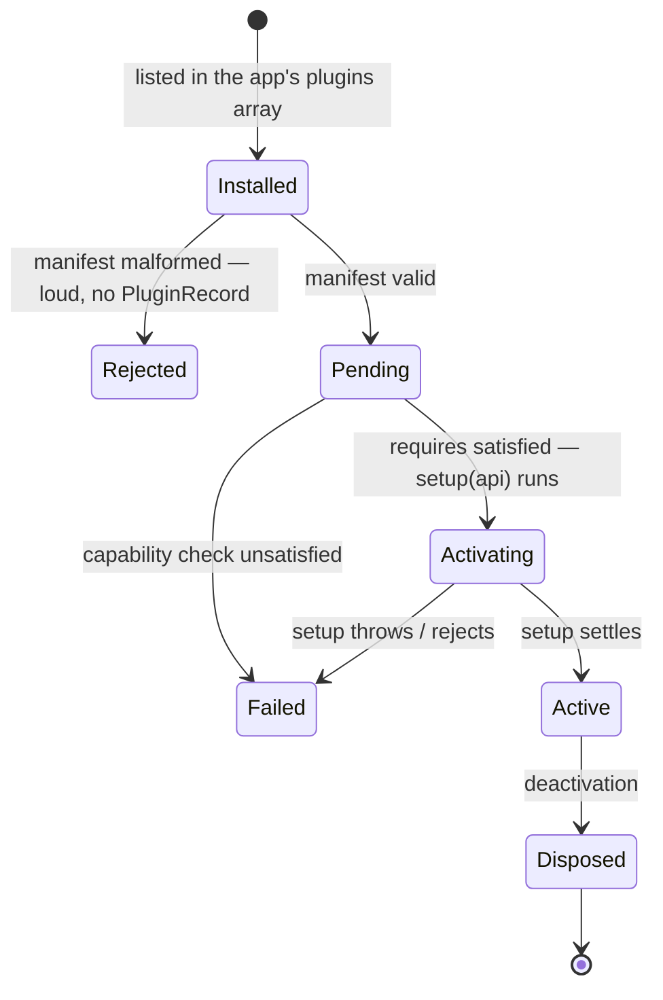
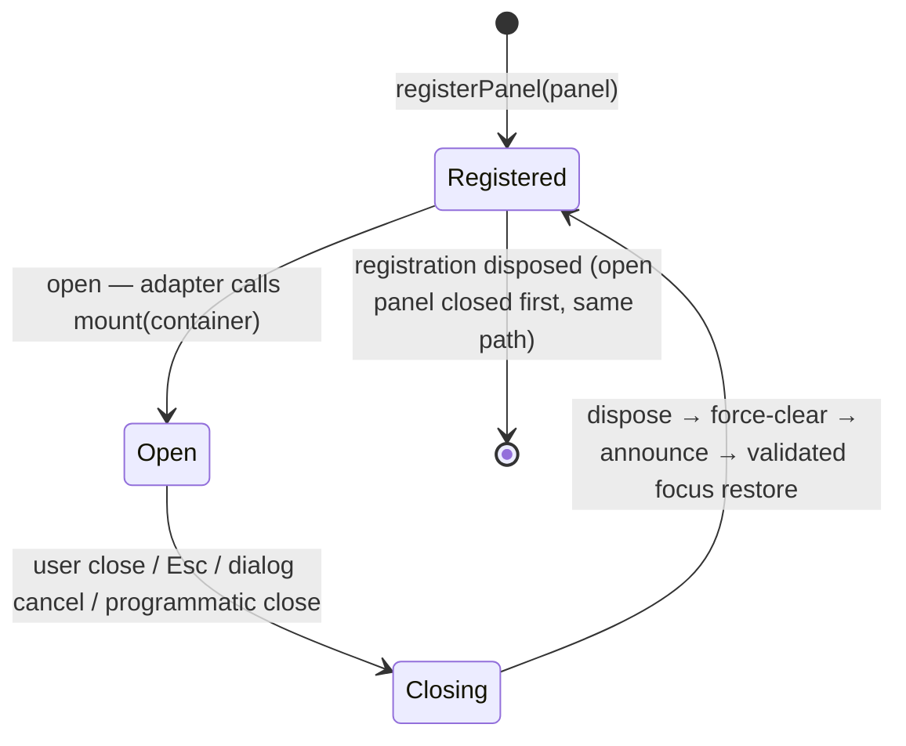
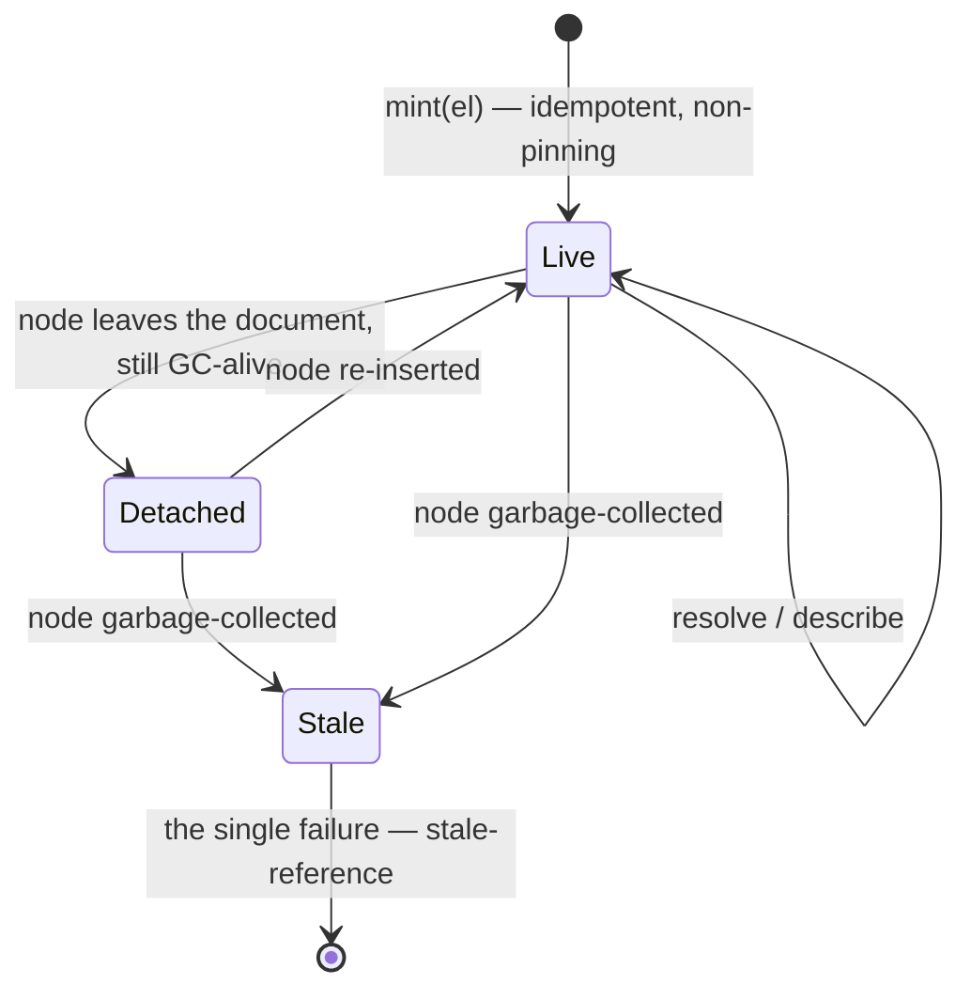

# Plugin, panel & element lifecycles

**This file owns the page-world lifecycles**: what states a plugin, a panel, and an ElementReference move through, and what survives each transition. Bridge-side lifecycles — connection and invocation — belong to [`bridge-flows.md`](./bridge-flows.md) and are not drawn here.

## The plugin lifecycle

The application developer's ordered `plugins` array is the activation order; the kernel never reorders it ([kernel §4.2](../spec/kernel-api.md#42-activation), [§18.1](../spec/kernel-api.md#181-signature)). Every failure along the way blocks **that plugin only** — the others proceed.

- **Manifest validation** ([kernel §3.3](../spec/kernel-api.md#33-manifest-validation)) — malformed manifests are rejected loudly and the plugin never gets a `PluginRecord`: a record needs a validated identity ([kernel §16.2](../spec/kernel-api.md#162-the-plugin-list)). Unknown fields are tolerated with a warning.
- **The capability check** ([kernel §10.3](../spec/kernel-api.md#103-the-check)) — once per plugin, before its `setup`: every `requires` entry must be satisfied by some installed plugin's `provides`. Failure is a loud `capability-unsatisfied` naming every near-miss.
- **`setup(api)`** ([kernel §4.2](../spec/kernel-api.md#42-activation)) — may be async; the kernel awaits it. During setup the plugin registers into the four registries; **every registration call returns a Disposable, and the kernel also tracks every Disposable it hands out** ([kernel §4.3](../spec/kernel-api.md#43-teardown-disposable)). `api.onDispose(fn)` covers effects the kernel cannot see (timers, DOM listeners).
- **`pending` / `active` / `failed`** are exactly the `status` values visible in `plugins.list()` ([kernel §16.2](../spec/kernel-api.md#162-the-plugin-list)).
- **Deactivation** — the kernel disposes everything it tracked plus the `onDispose` callbacks, so a plugin that never thinks about cleanup is still fully cleaned up.

**What survives deactivation:** the plugin's **context keys are not deleted** — some values legitimately outlive their writer; a writer that wants cleanup does it in `onDispose` ([kernel §8.4](../spec/kernel-api.md#84-ownership-and-cleanup)). Stored data also survives, by the storage durability promise ([kernel §13.4](../spec/kernel-api.md#134-durability-reachability-not-shape)). What does not survive: registrations, subscriptions, and services — a disposed provider's service unregisters ([kernel §9](../spec/kernel-api.md#9-services)).

Construction and teardown of the whole kernel sit around this: `createSwitchboard` is synchronous, activation proceeds un-awaited, `ready` settles when every plugin is `active` or `failed` (and never rejects), and `dispose()` tears down every plugin, then the kernel, then retracts the handoff announce — the HMR and test escape ([kernel §18.2](../spec/kernel-api.md#182-the-instance), [§17.3](../spec/kernel-api.md#173-retraction)).

## The panel lifecycle

Panels are surfaces the toolbar adapter owns; the plugin's world begins and ends at the container it is handed ([toolbar §5.2](../spec/toolbar-contract.md#52-the-mount-contract), [§5.3](../spec/toolbar-contract.md#53-plugin-obligations-inside-the-container)).

The close path exists **exactly once** — modal `cancel`, non-modal Esc, the close affordance, and programmatic close all route into the same code ([toolbar §8.3](../spec/toolbar-contract.md#83-p3--panels-are-native-dialog)), and it runs, in order:

1. call the mount's returned `dispose` (when one was returned);
2. **force-clear the container — unconditionally, even when `dispose` throws** ([toolbar §8.4](../spec/toolbar-contract.md#84-p4--mount-dispose-force-clear));
3. announce the state change via the live region ([toolbar §8.5](../spec/toolbar-contract.md#85-p5--announcements-shadow-internal-live-region-light-dom-fallback));
4. restore focus, **validating** the stored target and falling back to the panel's toggle when it is gone or `<body>` ([toolbar §8.6](../spec/toolbar-contract.md#86-p6--shadow-aware-focus-bookkeeping)).

**No keep-alive in v1**: every open mounts fresh and every close disposes. State that should survive reopening belongs in Context or storage — where it must live anyway to survive a page reload — never stashed in the mounted DOM ([toolbar §5.2](../spec/toolbar-contract.md#52-the-mount-contract)).

## The ElementReference lifecycle

A reference is a registry-minted handle to a live DOM node *instance*, valid only within the page session that minted it ([dom.inspector §2](../spec/dom-inspector-contract.md#2-elementreference)).

- **Mint is idempotent and non-pinning**: minting the same live node again yields the same `id`, and the registry holds nodes weakly — minting never extends a node's lifetime; **garbage collection is the only collector**, which is why there is no `release()` API: consumers have nothing to free, and a leaked reference costs a registry entry, not a DOM subtree ([dom.inspector §2.1](../spec/dom-inspector-contract.md#21-identity), [§3.1](../spec/dom-inspector-contract.md#31-non-pinning)).
- **Detachment is not death**: an out-of-document but GC-alive node still resolves and hydrates, reported as `connected: false`; the consumer decides what detachment means ([dom.inspector §3.3](../spec/dom-inspector-contract.md#33-detachment-is-not-death)).
- **One failure mode**: collected node or unknown id, surfaced as the single `stale-reference` named error (or `null` from `resolve`). The contract deliberately does not distinguish *unknown* from *expired* — WeakRef pruning makes that distinction unreliable exactly when it would matter ([dom.inspector §3.2](../spec/dom-inspector-contract.md#32-the-single-failure-stale-reference)).
- **Never survives a page session**: reference ids never repeat across sessions, so a reference carried over a reload can never silently resolve to the wrong node — it fails as stale. The durable anchor is a different concept with different physics: the **element description**, fuzzy re-location hints re-resolved best-effort by whoever stored them ([dom.inspector §7](../spec/dom-inspector-contract.md#7-element-descriptions-the-durable-anchor-split)). Storing a reference is always a bug.
