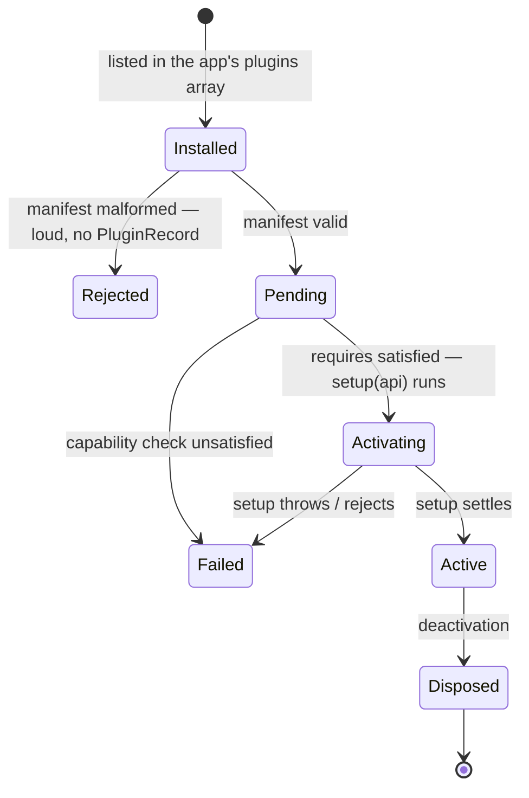
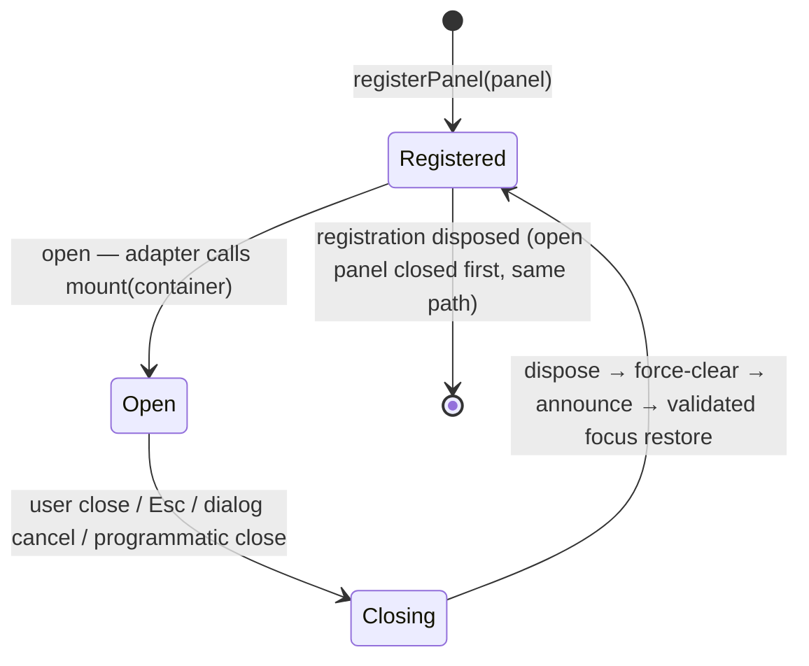
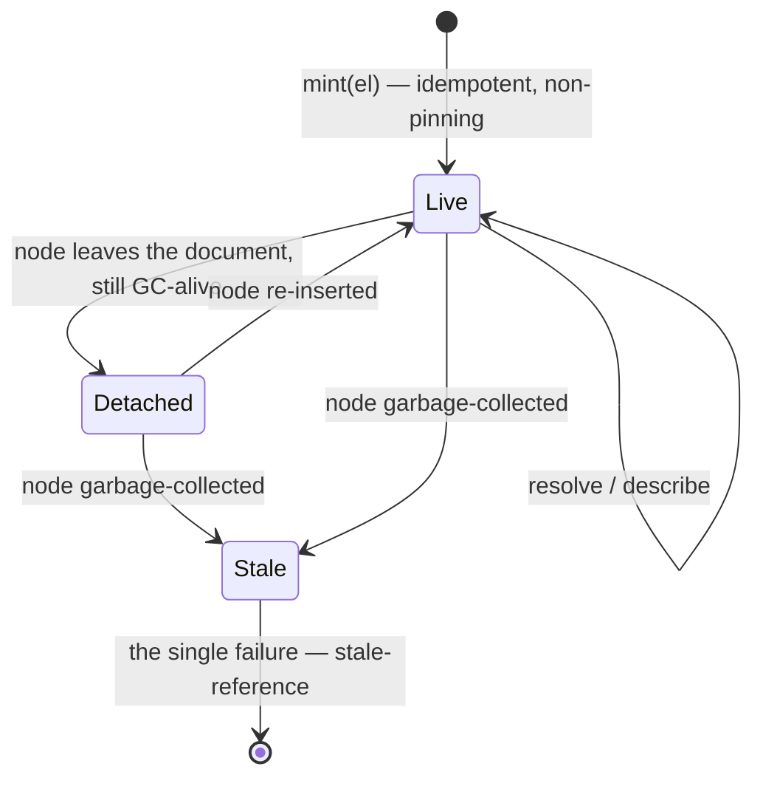

# Plugin, panel & element lifecycles

This file covers the in-page lifecycles: plugin states, panel states, and ElementReference validity, including what survives each transition. Bridge-side lifecycles — connection and invocation — are covered in [`bridge-flows.md`](./bridge-flows.md). Source of truth: [kernel §4.2](../spec/kernel-api.md#42-activation), [toolbar §5.2](../spec/toolbar-contract.md#52-the-mount-contract), [dom.inspector §2](../spec/dom-inspector-contract.md#2-elementreference).

## The plugin lifecycle

The application developer's ordered `plugins` array is the activation order, and the kernel never reorders it ([kernel §4.2](../spec/kernel-api.md#42-activation), [§18.1](../spec/kernel-api.md#181-signature)). Each failure blocks that plugin only; the others continue.

- **Manifest validation** ([kernel §3.3](../spec/kernel-api.md#33-manifest-validation)) — a malformed manifest is rejected loudly and the plugin never gets a `PluginRecord`, because a record needs a validated identity ([kernel §16.2](../spec/kernel-api.md#162-the-plugin-list)). Unknown fields are tolerated with a warning.
- **The capability check** ([kernel §10.3](../spec/kernel-api.md#103-the-check)) — runs once per plugin, before its `setup`. Every `requires` entry must be satisfied by some installed plugin's `provides`. Failure is a loud `capability-unsatisfied` naming every near-miss.
- **`setup(api)`** ([kernel §4.2](../spec/kernel-api.md#42-activation)) — may be async, and the kernel awaits it. During setup the plugin registers into the four registries. Every registration call returns a Disposable, and the kernel tracks every Disposable it hands out ([kernel §4.3](../spec/kernel-api.md#43-teardown-disposable)). `api.onDispose(fn)` covers effects the kernel cannot see, such as timers and DOM listeners.
- **`pending` / `active` / `failed`** are exactly the `status` values visible in `plugins.list()` ([kernel §16.2](../spec/kernel-api.md#162-the-plugin-list)).
- **Deactivation** — the kernel disposes everything it tracked plus the `onDispose` callbacks, so cleanup completes even when a plugin did not write full teardown logic of its own.

What survives deactivation: the plugin's context keys are not deleted, because some values legitimately outlive their writer. A writer that wants them cleaned up does that in `onDispose` ([kernel §8.4](../spec/kernel-api.md#84-ownership-and-cleanup)). Stored data also survives, under the storage durability promise ([kernel §13.4](../spec/kernel-api.md#134-durability-reachability-not-shape)). What does not survive: registrations, subscriptions, and services — a disposed provider's service unregisters ([kernel §9](../spec/kernel-api.md#9-services)).

The whole kernel's construction and teardown wrap around this. `createSwitchboard` is synchronous, and activation proceeds without being awaited. `ready` settles once every plugin is `active` or `failed`, and never rejects. `dispose()` tears down every plugin, then the kernel, then retracts the handoff announcement — which is what makes HMR and test cleanup work ([kernel §18.2](../spec/kernel-api.md#182-the-instance), [§17.3](../spec/kernel-api.md#173-retraction)).

## The panel lifecycle

Panels are surfaces managed by the toolbar adapter. A plugin may touch only the container it is handed ([toolbar §5.2](../spec/toolbar-contract.md#52-the-mount-contract), [§5.3](../spec/toolbar-contract.md#53-plugin-obligations-inside-the-container)).

A panel has a single close path. Modal `cancel`, non-modal Esc, the close button, and programmatic close all run the same code ([toolbar §8.3](../spec/toolbar-contract.md#83-p3--panels-are-native-dialog)), in this order:

1. call the mount's returned `dispose`, when one was returned;
2. force-clear the container, unconditionally, even when `dispose` throws ([toolbar §8.4](../spec/toolbar-contract.md#84-p4--mount-dispose-force-clear));
3. announce the state change through the live region ([toolbar §8.5](../spec/toolbar-contract.md#85-p5--announcements-shadow-internal-live-region-light-dom-fallback));
4. restore focus, validating the stored target and falling back to the panel's toggle when that target is gone or is `<body>` ([toolbar §8.6](../spec/toolbar-contract.md#86-p6--shadow-aware-focus-bookkeeping)).

There is no keep-alive in v1: every open mounts fresh, and every close disposes. State that should survive reopening belongs in Context or storage, where it has to live anyway to survive a page reload. It should never be stashed in the mounted DOM ([toolbar §5.2](../spec/toolbar-contract.md#52-the-mount-contract)).

## The ElementReference lifecycle

A reference is a registry-minted handle to a live DOM node *instance*, valid only within the page session that minted it ([dom.inspector §2](../spec/dom-inspector-contract.md#2-elementreference)).

- **Mint is idempotent and non-pinning.** Minting the same live node twice yields the same `id`, and the registry holds nodes weakly, so minting never extends a node's lifetime. Garbage collection is the only thing that removes a node, which is why there is no `release()` API: a consumer has nothing to free, and a leaked reference costs one registry entry rather than a DOM subtree ([dom.inspector §2.1](../spec/dom-inspector-contract.md#21-identity), [§3.1](../spec/dom-inspector-contract.md#31-non-pinning)).
- **Detachment is not death.** A node that has left the document but is still GC-alive resolves and hydrates normally, reported as `connected: false`. The consumer decides what detachment means ([dom.inspector §3.3](../spec/dom-inspector-contract.md#33-detachment-is-not-death)).
- **One failure mode.** A collected node or an unknown id surfaces as the single `stale-reference` named error, or as `null` from `resolve`. The contract deliberately does not distinguish *unknown* from *expired*, because WeakRef pruning makes that distinction unreliable exactly when it would matter ([dom.inspector §3.2](../spec/dom-inspector-contract.md#32-the-single-failure-stale-reference)).
- **Session-scoped only.** Reference ids never repeat across sessions, so a reference carried over a reload cannot silently resolve to the wrong node — it fails as stale. The durable anchor is a separate concept with its own lifecycle: the element description, a set of fuzzy re-location hints re-resolved best-effort by whoever stored them ([dom.inspector §7](../spec/dom-inspector-contract.md#7-element-descriptions-the-durable-anchor-split)). Storing a reference for cross-session use is a bug.
