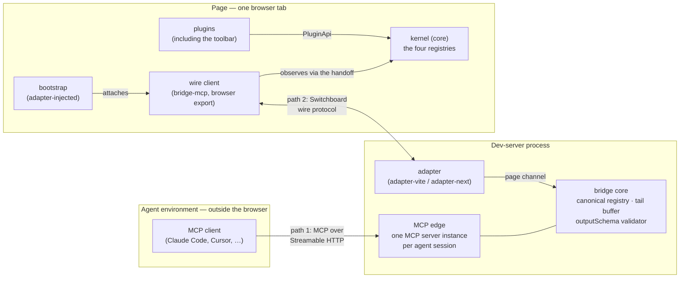

# Topology

This file describes the static layout of Switchboard: the three execution environments, the two communication paths and their protocols, the process boundaries, the security boundary, and multi-tab behavior. It does not describe the data that travels over those paths.

## The three execution environments

Switchboard spans three environments that do not share memory ([bridge §1](../spec/bridge-protocol.md#1-scope-and-topology)):

What runs where:

| Environment | Runs | Holds |
|---|---|---|
| Agent | Any MCP client | Its own MCP config (`.mcp.json` with the bridge URL) |
| Dev-server process | The adapter, the bridge core, the MCP edge (`bridge-mcp` node side) | The canonical registry, the tail buffer, the `outputSchema` validator ([bridge §10.4](../spec/bridge-protocol.md#104-result-shape-and-outputschema)) |
| Page | The kernel, the plugins, the toolbar, the wire client, the adapter bootstrap | The plugin manifests and registries; grant filtering happens here ([bridge §3.5](../spec/bridge-protocol.md#35-enforcement-points)) |

There is no fourth environment: the kernel is client-only, and SSR does not create one. Server code never calls `createSwitchboard`, so under Next there is no server-side kernel.

## Two paths, two protocols

The bridge translates between two different protocols ([bridge §1](../spec/bridge-protocol.md#1-scope-and-topology)):

- **The agent path uses MCP** over Streamable HTTP. By default this is `http://localhost:7654/mcp`, on the dedicated bridge port, not the app port ([adapter contract §2.1](../spec/adapter-contract.md#21-the-bridge-port))
- **The page path uses the Switchboard wire protocol** — a minimal envelope of typed JSON messages, not MCP and not JSON-RPC

The page path is intentionally not MCP. That keeps the two protocols separate and avoids leaking agent messages into the page layer.

The wire protocol is channel-agnostic: any ordered, reliable, bidirectional, message-oriented channel can carry it ([bridge §4.2](../spec/bridge-protocol.md#42-channel-requirements)). The shipped adapters provide the channel for the page path.

## Process boundaries

The page side of the wire protocol is implemented once, by the browser-only wire client exported from `bridge-mcp`. Adapters inject it and hand it a live, single-use connection handle.

Everything in the dev-server process is per-process and in memory: one bridge, one canonical registry, and one session map per dev-server process ([adapter contract §2](../spec/adapter-contract.md#2-process-model)).

## The security boundary

The v1 threat model is the malicious website versus the localhost dev server, including DNS rebinding and cross-site WebSocket hijacking. It is not a boundary against local processes.

The boundary, by path:

- **Binding** — both paths bind loopback only, and should bind both `127.0.0.1` and `::1`, because Node resolves `localhost` inconsistently ([bridge §15.1](../spec/bridge-protocol.md#151-binding-and-origin-policy))
- **MCP path** — an Origin allowlist rejects disallowed origins before protocol processing. Requests without an Origin header are accepted because terminal agents do not send one, and that would otherwise break valid local use
- **Page path** — the channel either uses a host channel with its own handshake protection, or it enforces an Origin allowlist itself. The default allowlist accepts loopback origins
- **Reserved `auth` field** — the `hello` message includes an optional `auth` field that v1 accepts and ignores, so a later adapter can require credentials without changing the protocol shape

## Multi-tab and the active tab

Multiple tabs may connect at once, each with its own wire connection, handshake, and snapshot. Agents still see one canonical surface: the tool list exposed to an agent must not vary by which tab is currently active.

## Summary

Topology is about where things run, which protocol each path uses, and what stays separated. The main constraints are: three environments, two protocols, client-only kernel creation, loopback-only binding, and one canonical agent-facing surface across tabs.
