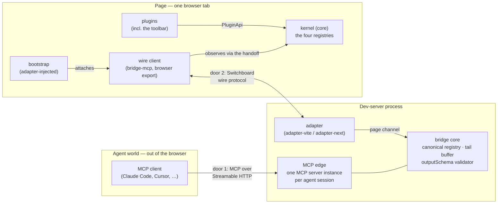

# Topology

**This file owns the static picture**: the three worlds, the two doors and their two protocols, process and security boundaries, and multi-tab. What travels *over* the wire — handshakes, snapshots, invocations — is [`bridge-flows.md`](./bridge-flows.md)'s subject; package ownership is [`components.md`](./components.md)'s.

## The three worlds

Switchboard spans three worlds that share no memory ([bridge §1](../spec/bridge-protocol.md#1-scope-and-topology)):

What runs where:

| World | Runs | Holds |
|---|---|---|
| Agent | any MCP client | its own MCP config (`.mcp.json` with the bridge URL) |
| Dev-server process | the adapter, the bridge core, the MCP edge (`bridge-mcp` node side) | the canonical registry, the tail buffer, the `outputSchema` validator ([bridge §10.4](../spec/bridge-protocol.md#104-outputschema-enforcement)), agent sessions |
| Page | the kernel, the plugins, the toolbar, the wire client, the adapter's bootstrap | the plugin manifests and registries — grant filtering happens here ([bridge §3.5](../spec/bridge-protocol.md#35-enforcement-point-the-page)) |

There is deliberately **no fourth world**: the kernel is client-only and SSR never constructs one — server code never calls `createSwitchboard`, so under Next there is no server-side kernel and no hydration-mismatch surface ([kernel §18.4](../spec/kernel-api.md#184-topology-client-only-one-kernel-per-tab)).

## Two doors, two languages

The bridge is a translation layer with a different protocol on each side ([bridge §1](../spec/bridge-protocol.md#1-scope-and-topology)):

- **The agent door speaks MCP** over Streamable HTTP — by default `http://localhost:7654/mcp`, always on the dedicated bridge port, never the app's port ([adapter contract §2.1](../spec/adapter-contract.md#21-the-mcp-door-lives-on-the-bridge-port), [§6.1](../spec/adapter-contract.md#61-default-and-fallbacks); override via `SWITCHBOARD_PORT`, [§6.2](../spec/adapter-contract.md#62-one-variable-drives-both-sides)).
- **The page door speaks the Switchboard wire protocol** — Switchboard's own minimal envelope of typed JSON messages, deliberately **not MCP and not JSON-RPC**.

The page leg is not MCP on purpose, twice over: keeping it unmistakably not-MCP **protects the two-language design from erosion** (nobody can "just pass the MCP message through" and start leaking agent-protocol concerns into the page), and it **insulates the page from MCP's transport churn** — MCP-era compatibility is the MCP SDK's problem at the edge, and the wire protocol's integer version is fully independent of MCP protocol versions ([bridge §1](../spec/bridge-protocol.md#1-scope-and-topology), [§2](../spec/bridge-protocol.md#2-versioning-the-handshake-gate)).

The wire protocol is channel-agnostic: any ordered, reliable, bidirectional, message-oriented channel qualifies ([bridge §4.2](../spec/bridge-protocol.md#42-channel-requirements)). The shipped adapters choose differently — adapter-vite rides Vite's HMR WebSocket; adapter-next mounts `/ws` on the bridge port ([adapter contract §2.2](../spec/adapter-contract.md#22-the-page-channel-is-the-adapters-choice)).

## Process boundaries

The page half of the wire protocol is implemented **once**, by the wire client shipped as the browser-only subpath export of `bridge-mcp`; adapters inject it and hand it live single-use connection handles rather than reimplementing any of it ([adapter contract §1.1](../spec/adapter-contract.md#11-the-split), [§3.1](../spec/adapter-contract.md#31-connection-handles)). The app writes zero bridge code: the adapter's bootstrap subscribes to the kernel handoff (`globalThis.__SWITCHBOARD__`, [kernel §17](../spec/kernel-api.md#17-the-kernel-handoff)) and attaches the wire client when a kernel announces itself ([adapter contract §8](../spec/adapter-contract.md#8-the-page-bootstrap)).

Everything in the dev-server process is per-process and in-memory: one bridge — one canonical registry, one session map — per dev-server process ([adapter contract §2](../spec/adapter-contract.md#2-topology-the-two-doors)), and all of it dies with the server; recovery is always a fresh handshake and fresh snapshot from a reconnecting page ([bridge §14.4](../spec/bridge-protocol.md#144-what-dies-with-the-server)).

## The security perimeter

The v1 threat model, stated exactly: **the malicious website versus the localhost dev server** (DNS rebinding, cross-site WebSocket hijacking). It is *not* a boundary against local processes — a localhost attacker has already won — and nothing in-page is a boundary against a malicious plugin, because v1 trusts plugin code ([bridge §15](../spec/bridge-protocol.md#15-security-posture-auth-v1), [kernel §1](../spec/kernel-api.md#1-scope)).

The perimeter, door by door:

- **Binding** — both doors bind loopback only, and SHOULD bind both literals `127.0.0.1` and `::1`, because Node resolves `localhost` inconsistently ([bridge §15.1](../spec/bridge-protocol.md#151-binding)).
- **MCP door** — an Origin allowlist refuses disallowed origins before any protocol processing. Requests **without** an Origin header are deliberately admitted: terminal agents don't send one, and the allowlist exists to refuse browser-borne cross-origin traffic, not non-browser clients ([bridge §15.2](../spec/bridge-protocol.md#152-mcp-door-origin-allowlist)).
- **Page door** — the channel either rides a host channel with its own handshake protection (Vite's post-CVE token handshake) or enforces an Origin allowlist itself; the default allowlist is any loopback origin, and one policy object governs both doors ([bridge §15.3](../spec/bridge-protocol.md#153-page-door-channel-security), [adapter contract §4.2](../spec/adapter-contract.md#42-the-default-policy)).
- **The reserved `auth` field** — the `hello` message carries an optional `auth` field that v1 tolerates and ignores, so a production-grade adapter can later demand credentials without a protocol version bump ([bridge §15.4](../spec/bridge-protocol.md#154-the-reserved-auth-field)).

## Multi-tab and the active tab

Several tabs may connect at once — each with its own wire connection, handshake, and snapshot — but agents see **one canonical surface**: the agent-facing tool list must not vary per agent connection, so multi-tab resolves to one **active tab** (most recently focused, falling back to most recently connected) rather than per-session tab affinity. The canonical registry mirrors the active tab's; invocations and context reads target it; if it disconnects, the bridge fails over to another connected tab ([bridge §13](../spec/bridge-protocol.md#13-active-tab-and-multi-tab)). The switching and failover mechanics are drawn in [`bridge-flows.md`](./bridge-flows.md).
